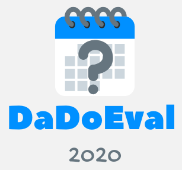

## Dating Document Evaluation at EVALITA 2020



- [Sub-tasks](#sub-tasks)
- [Data and Annotation Description](#data-and-annotation-description)
- [Evaluation](#evaluation)
- [How to participate](#how-to-participate)
- [Important Dates](#important-dates)
- [References](#references)

In the context of [EVALITA 2020](http://www.evalita.it/2020), we propose the task of assigning a temporal span to a document, i.e. recognising when a document was issued. The task has already been addressed in other languages, namely French, English, Polish, also in the framework of shared tasks, see for example the DÉfi Fouille de Textes (DEFT) 2010 and 2011 challenges (Grouin, 2010; Grouin, 2011), the SemEval-2015 task on Diachronic Text Evaluation (Popescu and Strapparava, 2015) and the RetroC challenge (Graliński, 2017). This task is relevant because it can play a role in document retrieval, summarisation, event detection, etc. It is also an important task per se, since it can be used to process large archival collections. In particular, when some documents in a collection have not been dated, supervised approaches could be applied to learn from the documents with a date which time span can be assigned to those who are not provided with temporal metadata.
Along this line, we proposed our task taking Alcide De Gasperi’s corpus of public documents (Tonelli et al., 2019) as a use case.

In is important to note that this is a novel task for the Italian community, and therefore participating systems should be built from scratch. 

The organizers rely on the honesty of all participants who might have some prior knowledge of part of the data that will be used for evaluation, not to unfairly use such knowledge.

### Sub-tasks

DaDoEval includes 6 sub-tasks:

1. *Coarse-grained classification on same-genre data*: participants are asked to assign each document in the test set to one of the main time periods that historians have identified in De Gasperi’s life, reported in the table below. Each document in the training set is labeled with one of the five periods and test data are of the **same genre** of the training data.
2. *Coarse-grained classification on cross-genre data*: participants are asked to assign each document in the test set to one of the main time periods that historians have identified in De Gasperi’s life, reported in the table below. Each document in the training set is labeled with one of the five periods but test data are of a **different genre** compared to the ones included in the training data.
3. *Fine-grained classification on same-genre data*: participants are asked to assign each document in the test set to one temporal slice of 5 years. Each document in the training set is labeled with a temporal slice and test data are of the **same genre** of the training data.
4. *Fine-grained classification on cross-genre data*: participants are asked to assign each document in the test set to one temporal slice of 5 years. Each document in the training set is labeled with a temporal slice but test data are be of a **different genre** compared to the ones included in the training data.
5. *Year-based classification on same-genre data*: participants are asked to assign each document in the test set to its exact year of publication. Each document in the training set is labeled with the exact year of publication and test data are of the **same genre** of the training data.
6. *Year-based classification on cross-genre data*: participants are asked to assign each document in the test set to its exact year of publication. Each document in the training set is labeled with the exact year of publication and test data are of the **different genre** compared to the ones included in the training data.

The aforementioned sub-tasks can be addressed in several ways. For example, researchers interested in historical content analysis can infer temporal information by looking at persons, places and time expressions, possibly integrating linking techniques. For those interested in studying semantic shifts, a purely lexical analysis may highlight changes in the lexical choices made by De Gasperi over time and give hints for document dating (Kulkarni et al, 2018). Also deep learning techniques, which proved effective on larger English corpora for document dating, could be tested (Vashishth et al., 2019). As an alternative, the sub-tasks could be addressed using document similarity techniques, so to assess to which training documents those in the test set are most similar, assuming that similar documents have been written in the same years. 

**Periods defined by historians for sub-tasks 1 and 2** 

| A       | B                         | C       | D                              | E                       |
|----------------|----------------------------------|----------------|---------------------------------------|--------------------------------|
| Habsburg years | Beginning of political activity | Internal exile | From fascism to the Italian Republic | Building the Italian Republic |
| 1901-1918      | 1919-1926                        | 1927-1942      | 1943-1947                             | 1948-1954                      |

### Data and Annotation Description
The corpus contains 2,762 documents, manually tagged with a date, written by De Gasperi and issued between 1901 and 1954. 
All the documents have been issued by the same person, thus removing the effects that different author styles can have on the dating process
Since we aim to propose a supervised task, the corpus will be split into a training and a test set.

In addition to the in-domain test set, we will also provide a cross-genre out-of-domain test set of around 100 letters, written by De Gasperi in the same time span of the corpus of public documents within the Epistolario project (Tonelli et al., 2020). This out-of-domain test set would allow DaDoEval organisers to evaluate the robustness of the proposed approaches, and measure how the specific characteristics of correspondence affect the dating process. For both corpora, there are no privacy issues and the documents can be made freely to task participants.

**[Training data](https://github.com/dhfbk/DaDoEval/blob/master/DadoEval2020-Train.zip) released!**

### Evaluation
Final results will be calculated in terms of **macro-average F1**. 

The evaluation script is available: [DaDoEval_Eval.py](https://github.com/dhfbk/DaDoEval/blob/master/DaDoEval_Eval.py).
```
usage: DaDoEval_Eval.py [-h] --gold_file GOLD_FILE --system_file SYSTEM_FILE

optional arguments:
  -h, --help            show this help message and exit
  --gold_file GOLD_FILE
                        Path to the TSV file with the gold data.
  --system_file SYSTEM_FILE
                        Path to the TSV file or folder containig TSV files
                        with the predicated data.
```
#### Baseline
As a baseline, we provide the scores obtained on same-genre test data adopting the same LogisticRegression configuration for each of the three subtasks. As features to represent the text we calculated the tf-idf for each term (unigram) in the dataset. The tf-idf is computed without removing stopwords or performing any preprocessing on the documents.

| SUB-TASK          | Macro-Average F1 |
|-------------------|------------------|
| 1) Coarse-grained | 0.827            |
| 3) Fine-grained   | 0.485            |
| 5) Year-based     | 0.126            |

### How to participate
Participants are required to submit their runs and to provide a technical report that should include a brief description of their approach, focusing on the adopted algorithms, models and resources, a summary of their experiments, and an analysis of the obtained results.

Runs should be a TSV file with fields delimited by a tab and it should follow the same format of the training dataset. No missing data are allowed: a class should be predicted for each document in the test set.

Once the system has produced the results for the task over the test set, participants have to follow these instructions for completing your submission:
- name the runs with the following filename format: *subtask_teamName_runID*.
For example: *1_fbk_1* would be the first run of a team called *fbk* for the first sub-task whereas *4_fbk_2* would be the second run of a team called *fbk* for the fourth sub-task.
- send the runs to the following email address: menini@fbk.eu, using the subject “DaDoEval Submission: teamName”.

### Important Dates
- 6th April 2020: [registration opens](http://www.evalita.it/2020/taskregistration)
- 29th May 2020: [training data](https://github.com/dhfbk/DaDoEval/blob/master/DadoEval2020-Train.zip) available to participants
- 4th September 2020: registration closes
- 4th-11th Sept. 2020: evaluation window and collection of participants' results 
- 6th November 2020: technical reports due to organizers - TENTATIVE
- 2nd-3rd December 2020: final workshop

### Organizers
- Stefano Menini (Fondazione Bruno Kessler) 
- Giovanni Moretti (Università Cattolica del Sacro Cuore di Milano)
- Rachele Sprugnoli (Università Cattolica del Sacro Cuore di Milano)
- Sara Tonelli (Fondazione Bruno Kessler)

Do you have doubts or questions? Join our GoogleGroup [https://groups.google.com/forum/embed/?place=forum/dadoeval_2020](https://groups.google.com/forum/embed/?place=forum/dadoeval_2020).


### References
- Graliński, F., Jaworski, R., Borchmann, Ł., & Wierzchoń, P. (2017). The RetroC challenge: how to guess the publication year of a text?. In Proceedings of the 2nd International Conference on Digital Access to Textual Cultural Heritage, pp. 29-34.
- Grouin, C., Forest, D., Da Sylva, L. and Zweigenbaum, P. (2010). Présentation et résultats du défi fouille de texte DEFT2010 Où et quand un article de presse a-t-il été écrit? In Actes du septième DÉfi Fouille de Textes.
- Grouin, C., Forest, D., Paroubek, P., and Zweigenbaum, P. (2011). Présentation et résultats du défi fouille de texte DEFT2011 Quand un article de presse a t-il été écrit? À quel article scientifique correspond ce résumé?. In Actes du sixième DÉfi Fouille de Textes.
- Kulkarni, V., Tian, Y., Dandiwala, P., and Skiena, S. (2018). Simple neologism based domain independent models to predict year of authorship. In Proceedings of the 27th International Conference on Computational Linguistics, pp. 202-212.
- Popescu, O. and Strapparava, C. (2015) Semeval 2015, task 7: Diachronic text evaluation. In Proceedings of the 9th International Workshop on Semantic Evaluation (SemEval 2015), pp. 870-878. 2015.
- Tonelli, S., Sprugnoli, R. and Moretti, G. (2019). Prendo la Parola in Questo Consesso Mondiale: A Multi-Genre 20th Century Corpus in the Political Domain. In Proceedings of CLIC-it 2019.
- Tonelli, S., Sprugnoli, R., Moretti, G., Malfatti, S., Odorizzi, M. (2020). Epistolario De Gasperi: National Edition of De Gasperi’s Letters in Digital Format. In Proceedings of AIUCD 2020.
- Vashishth, Shikhar, Dasgupta, Shib Sankar, Ray, Swayambhu Nath and Partha Talukdar (2019) Dating Documents using Graph Convolution Networks. In Proceedings of the 56th Annual Meeting of the Association for Computational Linguistics.


